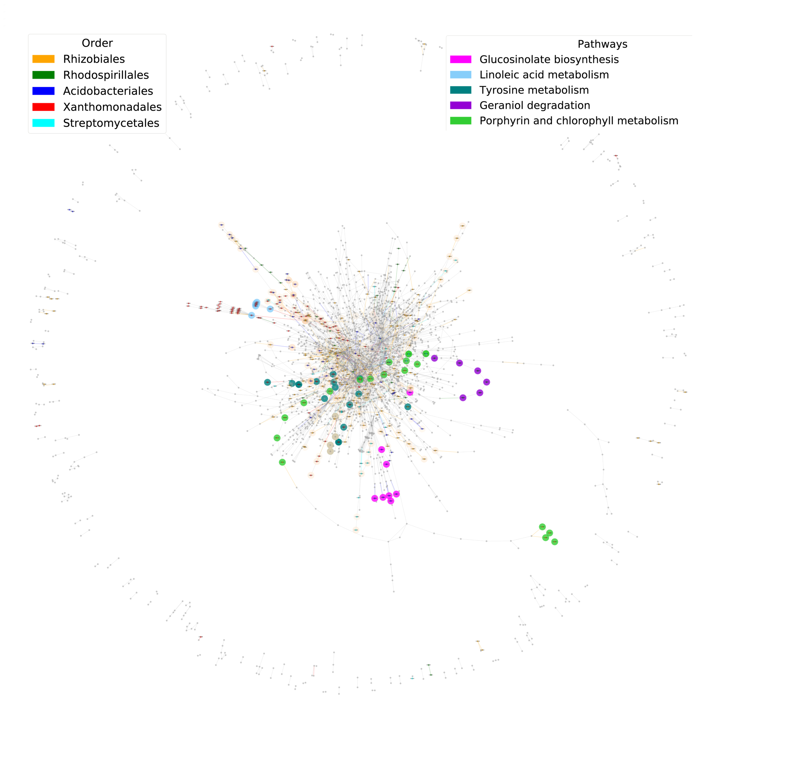

# NetCom2 - snakemake version

A pipeline for generating predictions for the selective targeting of microbial groups based on one the processing of assembled and annotated metagenomics. A detailed description of this workflow is provided at Ofaim S, Ofek-Lalzar M, Sela N, Jinag J, Kashi Y, Minz D, Freilich S: **Analysis of Microbial Functions in the Rhizosphere Using a Metabolic-Network Based Framework for Metagenomics Interpretation.** Frontiers in microbiology 2017, **8**:1606.**https://www.frontiersin.org/articles/10.3389/fmicb.2017.01606/full** (see also workflow\_description.md).

## Dependencies

* [python (3.8.18)]
* [r-base (4.2.3)]
* [pandas (1.5.1)]
* [networkx (3.1.0)]
* [matplotlib (3.3.3)]
* [ete3 (3.1.2)]
* [scikit-bio (0.5.6)]
* [multiprocess (0.70.16)]
* [scipy (1.12.0))]
* [bioconductor-edger (4.0.2))]
* [r-dplyr (1.1.4))]

## Installation

### Download and install NetCom2 on linux (Ubuntu 20.04)

1. clone using git

``` shell

git clone https://github.com/FreilichLab/NetCom2_snakemake.git

```
2. press on Code pulldown menue and download as zip and extract.


### Create virtual environment and install snakemake 

```shell

# mamba instaltion #

conda install -n base -c conda-forge mamba
 
mamba create -c conda-forge -c bioconda -n snakemake snakemake=7.19.1

```
## Configure workflow parameters 

- Input files should be located in *data* subdirectory within NetCom2_snakemake.

- User parameters and input file names are updated within the workflow configuration file (*config.yaml*).
located at *config* subdirectory within NetCom2\_snakemake.

## Input files for NetCom2

NetCom2 utilizes metagenomic data.

### Gene taxonomy annotation

1. Gene taxonomy annotation are  NCBI linage full (from root) information represented as  smi-colon (;) separted NCBI taxa ranks.

2. Genes without annotations must be denoted as "root;not assigned".

3. Annotation is provided in tab-delimited file (no header) as  (gene\_id)(tab)(linage).

4. Configuration paramter is gene\_taxonomy\_annotation.

5. Gene id is derived from contig id as suffix number, e.g, contig\_id\_2.

Example:

```shell

k141_5177763_1	"root;cellular organisms;Eukaryota;Opisthokonta;Fungi;Dikarya;Ascomycota;saccharomyceta;Pezizomycotina;leotiomyceta;sordariomyceta;Sordariomycetes;Hypocreomycetidae;Hypocreales;Nectriaceae;Fusarium;Fusarium oxysporum species complex;Fusarium oxysporum"
k141_5177763_4	"root;not assigned"

```

### Gene functional annotation

NetCom2 utilizes EC numbers as gene functional annotation for genes derived from metagenomic data.

1. Requried Gene functional annotation is EC number, e.g., EC:2.5.1.39.
NetCom2 can extract EC annotation from full annotation as provided by gene annotation softwere

2. Genes without annotations are must be denoted as Not assigned

3. Annotation is provided in tab-delimited  file (no header) as (gene\_id)(tab)(func\_annotation)
(func\_annotation) must include minimal EC annotation as 'EC:digit.'.

4. Configuration paramter is gene\_functional\_annotation.

5. Gene id is derived from contig id as suffix number, e.g, contig\_id\_2.

Example:

```shell

k141_5177763_2	EC:2.5.1.39
k141_5177763_1	Not assigned

```

### Contig count table

NetCom2 utilizes count table of contigs derived from metagenomic data within samples.

1. Contig id is the same as appears in gene\_id and denoted as ID column in count table (first)

2. Sample ids are columns and are same as in EdgeR sample\_data (config file).

3. Contig count table is in tab-delimited file (contig\_id)(tab)(sample\_id).
with header ID (tab) sample ids 

4. Configuration paramter is contig\_count\_table.

5. The order columns  of sample ids is the same as the rows in edgeR sample\_metadata file.

Example:

```shell
ID	001-cf1	002-cf2	003-cf3	004-cf4	005-cf5	006-cf6	007-NCF12	008-NCF13	009-NCF14	010-NCF15	011-NCF16	012-NCF17
k141_5177763	3.98861	4.79327	4.36945	2.91479	6.61842	2.21196	7.64748	8.12691	10.464	6.58794	5.03955	8.33582

```

### Differential abundance of ECs at at taxnomic level (edgeR).

NetCom2 determines the taxonomy of contigs from gene taxonomy annotation and calculates ECs abundances 
at user provided taxa rank (taxa\_level, config file).
NetCom2 determines differential abundance using edgeR tool and associates each EC to specific treatment (treatments in config file).
EC is assigned Not\_associated,if  differential abundance is not statistically  significant.

edgR input paramters:

1. sample\_metadata is tab-delimited file with minimal header (sample-id)(Treatment) 
    the order columns  of sample ids is the same as the rows in edgeR sample\_metadata file.

2. group\_name\_col is the  name of column in the metadata file that divide the samples in the groups with biological replicates.

3. contrasts contains definitions of contrasts for edgeR:
(group\_value\_1)'VS'(group\_value\_2) = ((group\_value\_1)) - ((group\_value\_2))
where  (group\_value\_1) and (group\_value\_1) are values in group\_name\_col.

4. fdr is false discovery rate set to 0.05 as defult. 

5. prifix for output file names

Example:

```shell

# sample metadata file #

sample-id	Treatment	
001-cf1	cf	
007-NCF12	NCF

# group_name_col #

group_name_col  = Treatment

# contrasts #

cfVSNCF = (cf) - (NCF)

# prifix #

prifix = "Compost_"

# fdr #

fdr = 0.05

```

## Final output: visualiztion of community 'knockouts'  simulations

visualiztion of community 'knockouts'  simulations for each treatment, cf and NCF are found
in results/community\_konckouts\_simulation in pdf and png formats as
(tretment\_vaule)\_treatment\_removal\_network\_knockout\_png.png and  
(tretment\_vaule)\_treatment\_removal\_network\_knockout\_pdf.pdf.

For example:

```shell

cf_treatment_removal_network_knockout_png.png 

cf_treatment_removal_network_knockout_pdf.pdf  

```
## Execution of NetCom2 workflow

```shell

# activate snakemake enviroment #

conda activate snakemake

# change directory to NetCom2_snakemake (working direcotry) #

cd NetCom2_snakemake

#Currently 10 cores are used change as needed #

snakemake --cores 10 results/edgeR/EC_diff_abundance.tsv

# Manuel run on netcom in webpage #

# go to  https://freilich-lab-tools-netcom.agri.gov.il/ (netcom)

#upload 'results/edgeR/EC_diff_abundance.tsv' to netcom 

#copy netcom result file (zip) to 'results/netcom' and extract using (unzip command).

cd results/netcom

unzip results.zip

# return to NetCom2_snakemake (working direcotry) and excute: #

snakemake --cores 10 results/merged_netcom2.txt  

```




## Contributors

[Gon Carmi](https://www.freilich-lab.com/members)

[Shiri Freilich](https://www.freilich-lab.com/) 

## References

Ofaim S, Zarecki R, Porob S, Gat D, Lahav T, Kashi Y, Aly R, Eizenberg H, Ronen Z, Freilich S: **Genome-scale reconstruction of Paenarthrobacter aurescens TC1 metabolic model towards the study of atrazine bioremediation**. Sci Rep 2020, 10(1):13019.

Tal O, Bartuv R, Vetcos M, Medina S, Jiang J, Freilich S: **NetCom: A Network-Based Tool for Predicting Metabolic Activities of Microbial Communities Based on Interpretation of Metagenomics Data**. Microorganisms 2021, 9(9):1838.

Ofaim S, Ofek-Lalzar M, Sela N, Jinag J, Kashi Y, Minz D, Freilich S: **Analysis of Microbial Functions in the Rhizosphere Using a Metabolic-Network Based Framework for Metagenomics Interpretation.** Frontiers in microbiology 2017, **8**:1606.**https://www.frontiersin.org/articles/10.3389/fmicb.2017.01606/full**.

## Funding

This work was funded by the United States - Israel Binational Agricultural Research and Development Fund (BARD) [grant number [US-5390-21]

